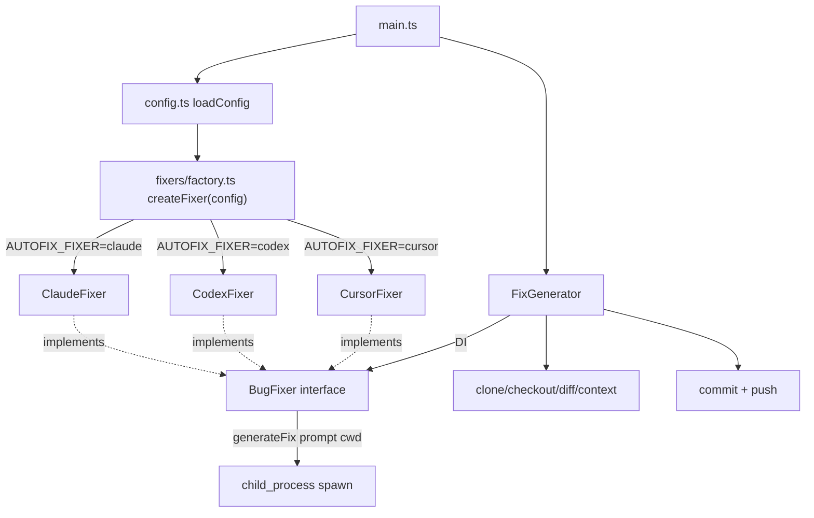

# Fixooly Multi-Backend Fixer Support

## 背景

Anthropic Claude のサブスクリプションを解約するため、Fixooly のバグ修正バックエンドを Claude CLI (`claude -p`) から **Cursor CLI (`agent -p`)** または **OpenAI Codex CLI (`codex exec`)** に移行可能にする。調査結果として:

- **Cursor CLI**: 月次プールのみで時間ウィンドウ制限なし、`CURSOR_API_KEY` のみで認証完結、`--trust` で headless 専用フラグあり → **daemon 用途に最適**
- **Codex CLI**: 5時間ローリング + 週次の二重制限、`auth.json` または `CODEX_API_KEY` で認証 → daemon の24/7稼働ではピーク時に枯渇しやすい

ユーザーは新規 **Cursor Pro ($20/月)** を契約予定。既存 Claude サポートも残し、3バックエンド切替可能とする。

## アーキテクチャ



## 1. 新規モジュール構成

### `src/fixers/types.ts` - 共通インターフェース

```typescript
export interface BugFixer {
  readonly name: "claude" | "codex" | "cursor";
  verifyPrerequisites(): Promise<void>;
  generateFix(input: FixerInput): Promise<string>;
}

export interface FixerInput {
  cwd: string;
  prompt: string;
  timeoutMs: number;
}
```

### `src/fixers/claudeFixer.ts` - 既存実装を切り出し

現在の `runClaudeFix` を `ClaudeFixer.generateFix` として移動。`ALLOWED_TOOLS` 定数と `--model` 引数もここに集約。`verifyPrerequisites` で `claude --version` と `CLAUDE_CODE_OAUTH_TOKEN`/`ANTHROPIC_API_KEY` をチェック。

### `src/fixers/cursorFixer.ts` - 新規実装

`agent -p --force --trust --workspace <cwd> --output-format json [--model <model>]` で呼び出し、プロンプトは stdin へ。

- `--force`: ファイル編集の承認スキップ
- `--trust`: headless モードのワークスペース信頼
- `--workspace`: 作業ディレクトリ指定 (cwd 代替)
- `--output-format json`: 結果を構造化取得
- `--model`: `AUTOFIX_CURSOR_MODEL` (推奨デフォルト `auto` または `composer-2.5`)

`verifyPrerequisites` で `agent --version` (もしくは `cursor-agent --version`) と `CURSOR_API_KEY` をチェック。

### `src/fixers/codexFixer.ts` - 新規実装

`codex exec --sandbox workspace-write --ask-for-approval never --cd <cwd> --json --skip-git-repo-check [--model <model>]` で呼び出し、プロンプトは stdin へ。

- `--sandbox workspace-write`: ワークスペース内編集のみ許可 (現状の Claude `allowedTools` 相当)
- `--ask-for-approval never`: 非対話実行
- `--cd`: 作業ディレクトリ指定
- `--json`: JSONL イベント出力
- `--model`: `AUTOFIX_CODEX_MODEL` (推奨 `gpt-5.3-codex`)

`verifyPrerequisites` で `codex --version` と (`CODEX_API_KEY` または `~/.codex/auth.json` 存在) をチェック。

### `src/fixers/factory.ts` - インスタンス生成

```typescript
export function createFixer(config: Config): BugFixer {
  switch (config.fixer) {
    case "claude": return new ClaudeFixer(config.claudeModel);
    case "codex":  return new CodexFixer(config.codexModel);
    case "cursor": return new CursorFixer(config.cursorModel);
  }
}
```

### `src/fixers/outputParser.ts` - 共通出力パーサ

現在 `src/fixGenerator.ts` の `extractSearchableText`, `parseCommitMessage`, `parseFixDetails` をここへ移動。Cursor (`json`) と Codex (`jsonl`) の構造化出力に対応:

- Claude: text or JSONL (既存 `result` フィールド抽出ロジック)
- Cursor: `--output-format json` の `result` フィールドを優先、フォールバックで stream-json の最終 assistant メッセージ
- Codex: JSONL イベントから `agent_message_delta` / `agent_message` の結合、または `--output-last-message` ファイル参照

`COMMIT_MSG:` と `FIX_DETAIL:` の抽出ロジックは全バックエンド共通。

## 2. 既存ファイルの変更

### `src/types.ts` - Config 拡張

```typescript
export type FixerKind = "claude" | "codex" | "cursor";

export interface Config {
  // ...既存フィールド
  fixer: FixerKind;
  claudeModel: string | null;
  codexModel: string | null;
  cursorModel: string | null;
}
```

### `src/config.ts` - 環境変数パース追加

新規 `AUTOFIX_FIXER` を**必須項目**として追加 (デフォルトなし)。`claude` / `codex` / `cursor` 以外はエラー。

```typescript
const fixer = parseFixerKind(process.env.AUTOFIX_FIXER);
const codexModel  = process.env.AUTOFIX_CODEX_MODEL?.trim()  || null;
const cursorModel = process.env.AUTOFIX_CURSOR_MODEL?.trim() || null;
```

### `src/fixGenerator.ts` - DI 化

- コンストラクタで `BugFixer` を受け取り、フィールドとして保持
- `runClaudeFix` を削除し、`this.fixer.generateFix({ cwd, prompt, timeoutMs })` を呼び出す
- 出力パーサ (`parseCommitMessage`, `parseFixDetails`) は新規 `outputParser.ts` から import
- `buildFixPrompt` などのコンテキスト構築ロジックは変更なし
- `CLAUDE_TIMEOUT_MS` を `FIXER_TIMEOUT_MS` にリネーム (10分は据え置き)

### `src/main.ts` - ファクトリ経由生成

```typescript
const fixer = createFixer(this.config);
await fixer.verifyPrerequisites();
this.fixGenerator = new FixGenerator(config, fixer);
```

既存の `verifyPrerequisites` 内の `claude --version` チェックは `fixer.verifyPrerequisites()` へ移譲。`git --version` チェックは残す。

ログ出力の `claudeModel` フィールドも `fixer: config.fixer, model: <選択モデル>` に変更。

## 3. ドキュメント・設定の更新

### `.env.example` - 推奨設定明記

```env
# Backend selection (required): claude | codex | cursor
# Recommended: cursor (no time-window limits, simple auth via CURSOR_API_KEY)
AUTOFIX_FIXER=cursor

# Cursor CLI settings (when AUTOFIX_FIXER=cursor)
AUTOFIX_CURSOR_MODEL=auto       # auto | composer-2.5 | ...
CURSOR_API_KEY=

# Codex CLI settings (when AUTOFIX_FIXER=codex)
AUTOFIX_CODEX_MODEL=gpt-5.3-codex
CODEX_API_KEY=                  # or use ~/.codex/auth.json

# Claude settings (when AUTOFIX_FIXER=claude) -- legacy
AUTOFIX_CLAUDE_MODEL=
CLAUDE_CODE_OAUTH_TOKEN=
ANTHROPIC_API_KEY=
```

### `README.md` - 新セクション追加

- **Backend Selection** セクション新設
- 3バックエンドの比較表 (定額範囲、認証、利用上限)
- 各CLIのインストール手順と認証手順
- 推奨は Cursor を明示 (時間制限なし、定額内に収まりやすい)
- アーキテクチャ図 (mermaid) を multi-backend に更新

### `CLAUDE.md`, `AGENTS.md` - アーキ説明更新

- `src/fixers/` の構造を追記
- BugFixer インターフェース、Factory パターンを説明
- 「Fix generation」セクションの記述を Claude 固定から「selected fixer」表現に変更

## 4. テスト

- `npm run typecheck` で全モジュールの型チェックを通過させる
- `npm run build` で `dist/` 生成成功を確認
- 実機テストは Cursor Pro 契約後にユーザーが実施 (現時点では型・ビルドのみ)

## 5. Plan Mode 後の追加作業 (ユーザールール準拠)

1. 新ブランチ `feature/multi-backend-fixer` を作成
2. `.plans/multi-backend-fixer.plan.md` をブランチに push
3. リポジトリに Issue 作成、plan.md リンクをコメント付与
4. 実装完了後、`Closes #<issue>` を含む PR を作成

## 制約・非対応事項

- **本実装では実機の Cursor / Codex 動作確認は行わない** (ユーザーが Cursor Pro 契約後に検証)
- バックエンド切替によるバグ修正の品質差分は別途検証 (本プランの範囲外)
- フォールバック機構 (Cursor 枯渇時に Codex へ自動切替) は含まない (将来課題)
