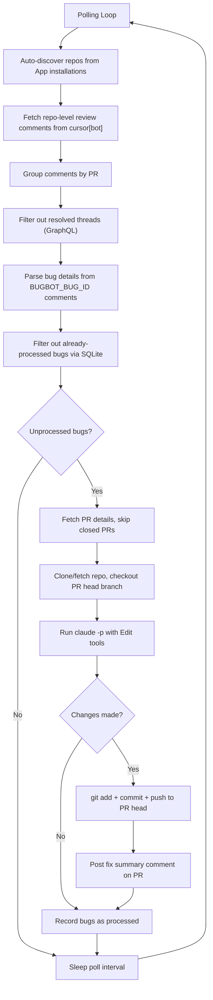

# Fixooly

Automatically fix [Cursor Bugbot](https://cursor.com/dashboard?tab=bugbot)-reported bugs using [Claude Code](https://docs.anthropic.com/en/docs/claude-code).

Monitors open pull requests for Cursor Bugbot review comments, parses bug reports, generates fixes via `claude -p`, and commits them directly to the PR head branch. A cost-effective alternative to Cursor's built-in Autofix.

## Features

- **Cursor Bugbot monitoring**: Polls GitHub for `cursor[bot]` review comments using repo-level API for efficient scanning
- **Resolved thread filtering**: Skips bugs whose review threads have been resolved (via GraphQL API)
- **Automatic bug parsing**: Extracts title, severity, description, file path, and line numbers from Bugbot's structured comment format
- **Claude Code fix generation**: Runs `claude -p` with Edit tools to fix detected bugs in cloned repositories
- **Direct commit to PR**: Pushes fixes directly to the PR head branch (no separate fix branch or approval workflow)
- **Duplicate prevention**: SQLite-based state tracking ensures each bug ID is processed only once
- **Single-instance lock**: File-based lock prevents multiple daemon instances from running concurrently
- **Fix summary comments**: Posts a summary comment on the PR listing all fixed issues with commit link
- **Auto-discovery**: Automatically monitors all repositories accessible to the GitHub App
- **Docker support**: Production-ready Dockerfile and docker-compose.yml

## Prerequisites

- A [GitHub App](https://docs.github.com/en/apps/creating-github-apps) with required permissions, installed on target organizations/user accounts
- **`claude` CLI**: Authenticated Claude Code (`claude --version`)
- **`git`**: For repository operations
- **Node.js** >= 18.0.0 (for local installation) or **Docker** (for containerized deployment)

## Authentication Setup

### GitHub App

Fixooly uses GitHub App authentication instead of personal access tokens. Create a GitHub App with the following permissions:

- **Repository permissions**: Contents (read & write), Pull requests (read & write), Issues (read & write)
- **Subscribe to events**: (none required, polling-based)

After creating the App:
1. Note the **App ID** from the App settings page
2. Generate and download a **private key** (`.pem` file)
3. Install the App on the organizations/user accounts whose repositories you want to monitor

### Claude Code Authentication

#### Option 1: OAuth Token (`CLAUDE_CODE_OAUTH_TOKEN`) -- for Pro/Max/Team plan

```bash
claude setup-token
```

#### Option 2: API Key (`ANTHROPIC_API_KEY`) -- for pay-as-you-go billing

1. Create an API key at [console.anthropic.com](https://console.anthropic.com/)
2. Set `ANTHROPIC_API_KEY` in `.env`

## Quick Start

### Local Installation

```bash
git clone https://github.com/Senna46/fixooly.git
cd fixooly

npm install

cp .env.example .env
# Edit .env: set AUTOFIX_APP_ID and AUTOFIX_PRIVATE_KEY_PATH

npm run build
npm start

# Or run in development mode
npm run dev
```

### Automated Setup

You can also use the automated setup script to configure your environment:

```bash
./setup-config.sh
```

### Docker

```bash
git clone https://github.com/Senna46/fixooly.git
cd fixooly

cp .env.example .env
# Edit .env with your GitHub App credentials and Claude auth

# Prevent Docker from creating ~/.claude.json as a directory
touch ~/.claude.json

docker compose build
docker compose up -d

# View logs
docker compose logs -f
```

## Configuration

Copy `.env.example` to `.env` and configure:

### GitHub App Credentials

| Variable | Required | Description |
|---|---|---|
| `AUTOFIX_APP_ID` | Yes | GitHub App ID |
| `AUTOFIX_PRIVATE_KEY_PATH` | Yes\* | Path to the App private key `.pem` file |
| `AUTOFIX_PRIVATE_KEY` | Yes\* | App private key content (alternative to path) |
| `AUTOFIX_PUSH_TOKEN` | No | Classic PAT for git push (triggers webhooks) |

\* Either `AUTOFIX_PRIVATE_KEY_PATH` or `AUTOFIX_PRIVATE_KEY` must be set.

Monitored repositories are auto-discovered from the GitHub App installations.

**Why `AUTOFIX_PUSH_TOKEN`?** GitHub does not fire webhook events for pushes made with App installation tokens. If you use integrations that react to push events (e.g. Cursor Bugbot), set a [classic PAT](https://github.com/settings/tokens) with `repo` scope. When set, Fixooly uses this token for `git push` only; all API operations still use the GitHub App.

### Behavior

| Variable | Required | Default | Description |
|---|---|---|---|
| `AUTOFIX_POLL_INTERVAL` | No | `120` | Polling interval in seconds |
| `AUTOFIX_WORK_DIR` | No | `~/.fixooly/repos` | Directory for cloning repositories |
| `AUTOFIX_DB_PATH` | No | `~/.fixooly/state.db` | SQLite database path |
| `AUTOFIX_CLAUDE_MODEL` | No | CLI default | Claude model to use |
| `AUTOFIX_LOG_LEVEL` | No | `info` | Log level (debug/info/warn/error) |

### Claude Authentication

| Variable | Required | Description |
|---|---|---|
| `CLAUDE_CODE_OAUTH_TOKEN` | macOS Docker only | Claude OAuth token (`claude setup-token`) |
| `ANTHROPIC_API_KEY` | Alternative | Anthropic API key for pay-as-you-go billing |

## Architecture



### Module Overview

| Module | Responsibility |
|---|---|
| `main.ts` | `FixoolyDaemon` polling loop, graceful shutdown, single-instance lock |
| `config.ts` | Loads and validates `AUTOFIX_*` environment variables |
| `bugbotMonitor.ts` | Efficient repo-level scanning, resolved thread filtering, bug discovery |
| `bugParser.ts` | Parses `cursor[bot]` comment bodies into structured `BugbotBug` objects |
| `fixGenerator.ts` | Clones repos, runs `claude -p`, commits and pushes fixes |
| `githubClient.ts` | Octokit wrapper: GitHub App auth, repo-level comments, GraphQL threads, PR details |
| `state.ts` | SQLite tracking of processed bug IDs to prevent duplicates |
| `types.ts` | Shared TypeScript interfaces |
| `logger.ts` | Structured logging with configurable levels |

## Running as a Service

### Docker (recommended)

```bash
docker compose up -d
```

Management commands:

```bash
docker compose ps          # Check status
docker compose logs -f     # View logs
docker compose restart     # Restart
docker compose down        # Stop
docker compose down -v     # Remove with data
```

### macOS (launchd)

To run as a native LaunchAgent (starts on login, restarts on failure), use the install script. See [deploy/README.md](deploy/README.md) for details.

From the project root:

```bash
npm run build
chmod +x deploy/install-daemon.sh
./deploy/install-daemon.sh
```

Logs: `~/.fixooly/logs/stdout.log` and `~/.fixooly/logs/stderr.log`.

## Related Projects

- [Claude Code BugHunter](https://github.com/Senna46/claude-code-bughunter) -- Self-hosted PR bug detection agent (detection + fix)

## License

MIT
